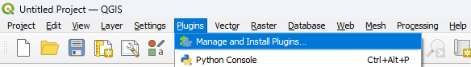
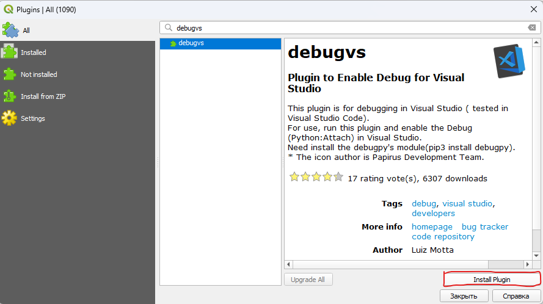
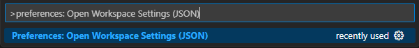
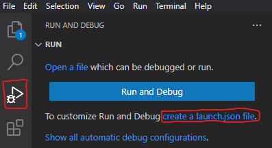
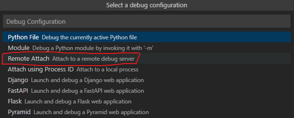
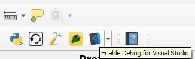

# Debig QGIS Plugin


- [Usage](#usage)
    - [1. Install debugvs plugin](#1.-Install-debugvs-plugin)
    - [2. Configure VSCode](#2.-Configure-VSCode)
        - [2.1 Configuring Workspace](#21-configuring-workspace)
        - [2.2 Create launch.json file](#22-create-launchjson-file)
    - [3. Debug plugin](#3-debug-plugin)

## Usage

### 1. Install debug_vs plugin

1. Open QGIS.
2. Click on "Plugins"->"Manage and install plugins"

    

3. Search for debugvs. Click on "Install Plugin"

    

4. If you are on Windows, then fix %appdata%\QGIS\QGIS3\profiles\default\python\plugins\debug_vs\__init__.py file

    ```
    try:
        import debugpy

        self.debugpy = debugpy
        self.debugpy.configure(python = 'python3') # New line
    except:
        pass
    ```

5. Install pydebug module. Open C:\Program Files\QGIS 3.32.2\OSGeo4W.bat and call:

    ```
    pip3 install debugpy
    pip3 install pyqt5-stubs # not neccesary
    ```

### 2. Configure VSCode
#### 2.1 Configuring Workspace
1. Open VSCode. Locate to plugin folder
2. press "Ctrl-Shift-P" and type ">preferences: Open Workspace Settings (JSON)"

    

3. Open "./.vscode/settings.json" file and add the following lines (Change qgis and python versions if needed)

    ```
    {
        "python.defaultInterpreterPath": "C:\\Program Files\\QGIS 3.32.2\\apps\\Python39\\python.exe",
        "python.autoComplete.extraPaths": [
            "C:\\Program Files\\QGIS 3.32.2\\apps\\qgis\\python"
        ],
        "python.analysis.extraPaths": [
            "C:\\Program Files\\QGIS 3.32.2\\apps\\qgis\\python"
        ]
    }
    ```

#### 2.2 Create launch.json file
1. Click on "Run and debug" button -> "create launch.json file"

    

2. Choose python -> select "Remote Attach"

    

3. The launch file must looks like:

    ```
    {
        // Use IntelliSense to learn about possible attributes.
        // Hover to view descriptions of existing attributes.
        // For more information, visit: https://go.microsoft.com/fwlink/?linkid=830387
        "version": "0.2.0",
        "configurations": [
            {
                "name": "Python: Remote Attach",
                "type": "python",
                "request": "attach",
                "connect": {
                    "host": "localhost",
                    "port": 5678
                },
                "justMyCode": true
            }
        ]
    }
    ```


### 3. Debug plugin

1. Inside QGIS click on "Enable Debug for Visual Studio Code"

    

2. Inside VSCode press "F5" for attaching

